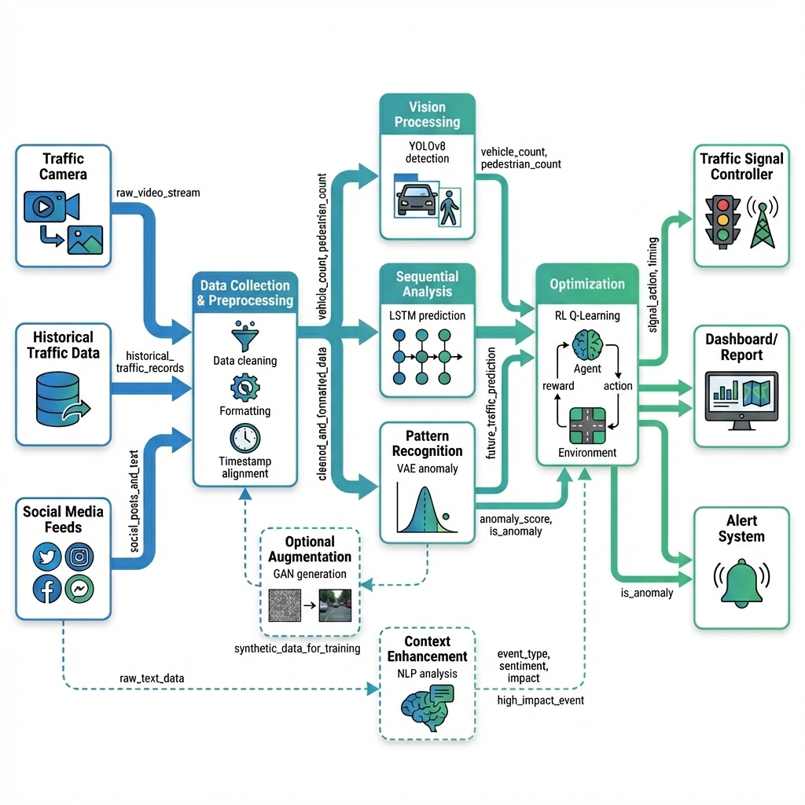

# 🚦 AI-Driven Urban Traffic Optimization

[](https://python.org)
[](https://tensorflow.org)
[](https://pytorch.org)
[](LICENSE)

> A comprehensive deep learning pipeline for intelligent urban traffic analysis and optimization, integrating Computer Vision, LSTM forecasting, VAE anomaly detection, GAN data augmentation, and Reinforcement Learning.



---

## 📋 Table of Contents

- [Overview](#overview)
- [Features](#features)
- [Architecture](#architecture)
- [Installation](#installation)
- [Quick Start](#quick-start)
- [Modules](#modules)
  - [Module 1: Vision (YOLOv8)](#module-1-vision-yolov8)
  - [Module 2: LSTM Forecasting](#module-2-lstm-forecasting)
  - [Module 3: VAE Anomaly Detection](#module-3-vae-anomaly-detection)
  - [Module 4: GAN Data Augmentation](#module-4-gan-data-augmentation)
  - [Module 5: Reinforcement Learning](#module-5-reinforcement-learning)
  - [Module 6: NLP Social Media Analysis](#module-6-nlp-social-media-analysis)
- [Integration Layer](#integration-layer)
- [Usage](#usage)
- [Project Structure](#project-structure)
- [Results](#results)
- [Contributing](#contributing)
- [License](#license)

---

## 🎯 Overview

This project implements an **end-to-end AI-driven traffic optimization system** that combines five deep learning approaches to analyze, predict, and optimize urban traffic flow. The system processes real-time traffic data to:

- **Detect** vehicles and pedestrians using computer vision
- **Predict** future traffic patterns using sequence modeling
- **Identify** anomalies and unusual traffic patterns
- **Augment** limited training data for improved model performance
- **Optimize** traffic signal timing using reinforcement learning

---

## ✨ Features

| Feature | Description |
|---------|-------------|
| 🎥 **Real-time Detection** | YOLOv8-based vehicle and pedestrian counting |
| 📈 **Traffic Forecasting** | LSTM neural networks for sequence prediction |
| 🔍 **Anomaly Detection** | Variational Autoencoder for identifying unusual patterns |
| 🔄 **Data Augmentation** | GAN-based synthetic traffic data generation |
| 🎮 **Smart Optimization** | Q-Learning for adaptive traffic signal control |
| 📱 **Social Media Analysis** | NLP-based event detection and sentiment analysis |
| 🔗 **Unified Pipeline** | Integrated orchestration of all modules |
| 📊 **CLI Interface** | Easy-to-use command line interface |
| ⚙️ **Configurable** | Flexible configuration management |

---

## 🏗 Architecture

The system follows a modular architecture with five specialized deep learning modules connected through an integration layer:

```
┌─────────────────────────────────────────────────────────────────┐
│                    Integration Layer (Pipeline)                  │
├─────────────────────────────────────────────────────────────────┤
│                                                                  │
│   ┌──────────┐   ┌──────────┐   ┌──────────┐   ┌──────────┐    │
│   │  Vision  │──▶│   LSTM   │──▶│   VAE    │──▶│    RL    │    │
│   │ (YOLOv8) │   │ Forecast │   │ Anomaly  │   │ Q-Learn  │    │
│   └──────────┘   └──────────┘   └──────────┘   └──────────┘    │
│         │                             ▲                          │
│         │                             │                          │
│         │        ┌──────────┐         │                          │
│         └───────▶│   GAN    │─────────┘                          │
│                  │   Augment │                                   │
│                  └──────────┘                                    │
│                                                                  │
└─────────────────────────────────────────────────────────────────┘
```

### Data Flow

1. **Vision Module** → Detects vehicles/pedestrians from images/video
2. **LSTM Module** → Predicts future traffic based on historical sequences
3. **VAE Module** → Detects anomalies in traffic patterns
4. **GAN Module** → Generates synthetic data for training augmentation
5. **RL Module** → Recommends optimal traffic signal timing
6. **NLP Module** → Analyzes social media for traffic events and sentiment

---

## 🚀 Installation

### Prerequisites

- Python 3.8 or higher
- CUDA-capable GPU (recommended for faster inference)
- Git

### Setup

1. **Clone the repository**
   ```bash
   git clone https://github.com/Talalzahid868/Intelligent_Urban_Traffic_Optimization.git
   cd Intelligent_Urban_Traffic_Optimization
   ```

2. **Create a virtual environment**
   ```bash
   python -m venv venv
   
   # Windows
   venv\Scripts\activate
   
   # Linux/macOS
   source venv/bin/activate
   ```

3. **Install dependencies**
   ```bash
   pip install -r requirements.txt
   ```

   > **Note**: For GPU support with PyTorch, install the appropriate CUDA-enabled build from [pytorch.org](https://pytorch.org/get-started/locally/)

4. **Verify installation**
   ```bash
   python -c "import torch; import tensorflow; print('Installation successful!')"
   ```

---

## ⚡ Quick Start

### Run Demo Pipeline

```bash
python -m integration.main --demo
```

### Process Traffic Data

```bash
# Single analysis mode
python -m integration.main --input Outputs/module1_results.csv

# Batch processing mode
python -m integration.main --input data.csv --mode batch --output results.csv
```

### Python API

```python
from integration.config import Config
from integration.pipeline import TrafficOptimizationPipeline, PipelineOptions

# Initialize pipeline
config = Config()
options = PipelineOptions(
    enable_vision=True,
    enable_lstm=True,
    enable_vae=True,
    enable_gan=False,
    enable_rl=True
)

pipeline = TrafficOptimizationPipeline(config=config, options=options)

# Load and process data
pipeline.load_data("Outputs/module1_results.csv")
result = pipeline.run()

# Get recommendations
print(result.summary())
```

---

## 📦 Modules

### Module 1: Vision (YOLOv8)

**Location**: `module1_vision/`

Performs real-time object detection on traffic images using YOLOv8.

| Component | Description |
|-----------|-------------|
| `detector.py` | `TrafficDetector` class for vehicle/pedestrian counting |
| `yolov8n.pt` | Pre-trained YOLOv8 nano model |
| `main.py` | Standalone vision module runner |

**Detected Classes**:
- 🚗 Vehicles: car (2), motorcycle (3), bus (5), truck (7)
- 🚶 Pedestrians: person (0)

```python
from module1_vision.detector import Trafficdetector

detector = Trafficdetector()
vehicle_count, pedestrian_count = detector.detect(image)
```

---

### Module 2: LSTM Forecasting

**Location**: `module2_LSTM/`

Time-series forecasting of traffic patterns using LSTM neural networks.

| Component | Description |
|-----------|-------------|
| `lstm_sequence.ipynb` | Training and evaluation notebook |
| `Traffic_Model_LSTM.h5` | Trained LSTM model (Keras/TensorFlow) |

**Key Features**:
- Sequence length: 10 timesteps
- Predicts vehicle counts for future intervals
- Handles temporal dependencies in traffic data

---

### Module 3: VAE Anomaly Detection

**Location**: `module3_VEA/`

Variational Autoencoder for detecting anomalous traffic patterns.

| Component | Description |
|-----------|-------------|
| `VAE.ipynb` | VAE training and anomaly detection notebook |

**Capabilities**:
- Learns latent representations of normal traffic
- Identifies unusual patterns via reconstruction error
- Configurable latent dimension (default: 2)

---

### Module 4: GAN Data Augmentation

**Location**: `module4_GAN/`

Generative Adversarial Network for synthetic traffic data generation.

| Component | Description |
|-----------|-------------|
| `GAN.ipynb` | GAN training notebook |
| `traffic_generator.keras` | Trained generator model |
| `generated_traffic_data.csv` | Sample generated data |

**Outputs**:
- `distribution_comparison.png` - Real vs. synthetic distributions
- `scatter_comparison.png` - Feature scatter plots
- `training_losses.png` - Training progress visualization

---

### Module 5: Reinforcement Learning

**Location**: `module5_RL/`

Q-Learning agent for optimizing traffic signal timing.

| Component | Description |
|-----------|-------------|
| `RL.ipynb` | RL training and evaluation notebook |
| `traffic_qlearning_policy.pkl` | Trained Q-table policy |
| `training_results.csv` | Training metrics log |

**Action Space**:
- 🟢 Short Green (10s) - Low traffic
- 🟢 Medium Green (20s) - Normal traffic
- 🟢 Long Green (30s) - High traffic
- 🚨 Emergency Mode - Critical situations

**Visualizations**:
- `policy_comparison.png` - Policy performance comparison
- `policy_evaluation.png` - Policy evaluation metrics
- `training_progress.png` - Learning curves

---

### Module 6: NLP Social Media Analysis

**Location**: `module6_NLP/`

Natural Language Processing for analyzing traffic-related social media content.

| Component | Description |
|-----------|-------------|
| `nlp_social_media.ipynb` | NLP analysis and training notebook |
| `nlp_analysis_results.csv` | Sample analysis results |
| `nlp_analysis_results.png` | Visualization of analysis |

**Capabilities**:
- 🚨 **Event Detection**: Identify accidents, road closures, construction
- 🎭 **Sentiment Analysis**: Analyze public sentiment about traffic
- 📍 **Location Extraction**: Extract geographic entities (NER)
- 📊 **Impact Scoring**: Calculate traffic impact scores (0-100)

**Models Used**:
- `distilbert-base-uncased-finetuned-sst-2-english` - Sentiment
- `dslim/bert-base-NER` - Named Entity Recognition

---

## 🔗 Integration Layer

**Location**: `integration/`

The integration layer provides a unified interface for orchestrating all modules.

### Core Components

| File | Purpose |
|------|---------|
| `pipeline.py` | `TrafficOptimizationPipeline` - Main orchestrator |
| `config.py` | Configuration management |
| `data_pipeline.py` | Data loading and preprocessing |
| `main.py` | CLI entry point |

### Module Wrappers

```
integration/
├── wrappers/
│   ├── vision_wrapper.py
│   ├── lstm_wrapper.py
│   ├── vae_wrapper.py
│   ├── gan_wrapper.py
│   ├── rl_wrapper.py
│   └── nlp_wrapper.py
└── utils/
    ├── logging_utils.py
    └── data_formats.py
```

### Configuration

```python
from integration.config import Config

config = Config()

# Access module paths
print(config.paths.vision_dir)
print(config.paths.lstm_dir)

# Get model file paths
lstm_model = config.get_model_path('lstm')
rl_policy = config.get_model_path('rl')

# Configure thresholds
config.pipeline.low_congestion_threshold = 10
config.pipeline.medium_congestion_threshold = 25
```

---

## 💻 Usage

### Command Line Interface

```bash
# Show all options
python -m integration.main --help

# Run demo mode
python -m integration.main --demo

# Process with specific options
python -m integration.main \
    --input data.csv \
    --output results.json \
    --mode batch \
    --verbose \
    --no-vae \
    --enable-gan
```

### CLI Options

| Option | Description |
|--------|-------------|
| `--input, -i` | Path to input CSV file |
| `--output, -o` | Path to output file (CSV or JSON) |
| `--mode, -m` | Processing mode: `single` or `batch` |
| `--demo` | Run demonstration with sample data |
| `--verbose, -v` | Enable verbose output |
| `--no-lstm` | Disable LSTM prediction |
| `--no-vae` | Disable VAE anomaly detection |
| `--no-rl` | Disable RL optimization |
| `--enable-gan` | Enable GAN data augmentation |
| `--enable-nlp` | Enable NLP social media analysis |

---

## 📁 Project Structure

```
Intelligent_Urban_Traffic_Optimization/
│
├── integration/                 # Integration layer
│   ├── __init__.py
│   ├── config.py               # Configuration management
│   ├── data_pipeline.py        # Data loading utilities
│   ├── main.py                 # CLI entry point
│   ├── pipeline.py             # Main pipeline orchestrator
│   ├── wrappers/               # Module wrappers
│   └── utils/                  # Helper utilities
│
├── module1_vision/             # Computer Vision (YOLOv8)
│   ├── detector.py             # Traffic detector class
│   ├── main.py                 # Standalone runner
│   └── yolov8n.pt              # YOLOv8 model weights
│
├── module2_LSTM/               # Time-series Forecasting
│   ├── lstm_sequence.ipynb     # Training notebook
│   └── Traffic_Model_LSTM.h5   # Trained LSTM model
│
├── module3_VEA/                # Anomaly Detection (VAE)
│   └── VAE.ipynb               # VAE notebook
│
├── module4_GAN/                # Data Augmentation
│   ├── GAN.ipynb               # GAN training notebook
│   ├── traffic_generator.keras # Trained generator
│   └── *.png                   # Visualization outputs
│
├── module5_RL/                 # Reinforcement Learning
│   ├── RL.ipynb                # Q-Learning notebook
│   ├── traffic_qlearning_policy.pkl
│   └── *.png                   # Training visualizations
│
├── module6_NLP/                # NLP Social Media Analysis
│   ├── nlp_social_media.ipynb  # NLP notebook
│   ├── nlp_analysis_results.csv
│   └── nlp_analysis_results.png
│
├── Outputs/                    # Pipeline outputs
│   └── module1_results.csv     # Vision module results
│
├── requirements.txt            # Python dependencies
├── .gitignore
└── README.md                   # This file
```

---

## 📊 Results

### Traffic Detection Performance

The Vision module using YOLOv8 achieves:
- **Real-time processing** at 30+ FPS
- **High accuracy** for vehicle and pedestrian detection
- **Multi-class support** for different vehicle types

### RL Policy Evaluation

The Q-Learning agent demonstrates:
- **Convergence** within 10,000 episodes
- **Adaptive behavior** based on congestion levels
- **Reduced wait times** compared to fixed-timing baselines

---

## 🔧 Requirements

```txt
ultralytics          # YOLOv8 for object detection
torch               # PyTorch for deep learning
tensorflow          # TensorFlow/Keras for LSTM, VAE, GAN
opencv-python       # Image processing
numpy               # Numerical computing
pandas              # Data manipulation
scikit-learn        # Machine learning utilities
gym                 # Reinforcement learning environments
matplotlib          # Visualization
jupyter             # Notebook support
transformers        # HuggingFace transformers for NLP
nltk                # Natural language toolkit
```

---

## 🤝 Contributing

Contributions are welcome! Please follow these steps:

1. Fork the repository
2. Create a feature branch (`git checkout -b feature/AmazingFeature`)
3. Commit your changes (`git commit -m 'Add some AmazingFeature'`)
4. Push to the branch (`git push origin feature/AmazingFeature`)
5. Open a Pull Request

---

## 📄 License

This project is licensed under the MIT License - see the [LICENSE](LICENSE) file for details.

---

## 👥 Authors

- **Talal Zahid** - [GitHub](https://github.com/Talalzahid868)

---

## 🙏 Acknowledgments

- [Ultralytics YOLOv8](https://github.com/ultralytics/ultralytics) for object detection
- [OpenAI Gym](https://gymnasium.farama.org/) for RL environments
- The deep learning community for inspiration and resources

---

<p align="center">
  Made with ❤️ for smarter cities
</p>
